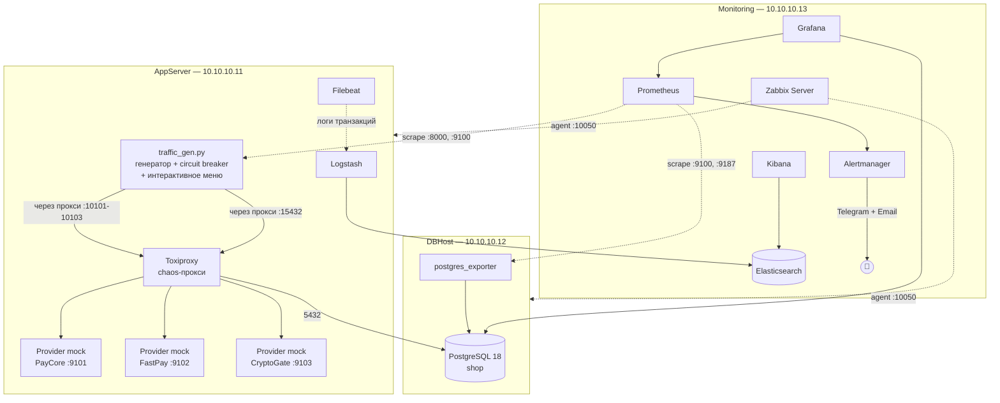
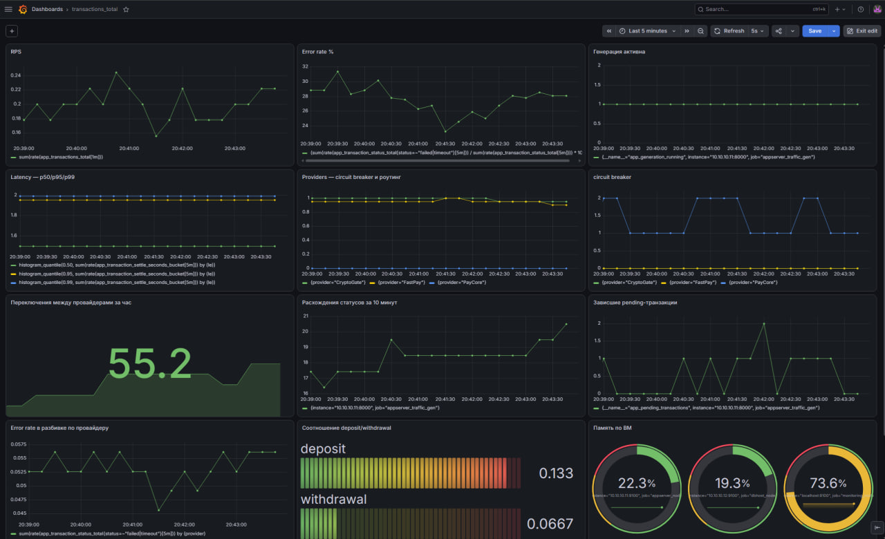
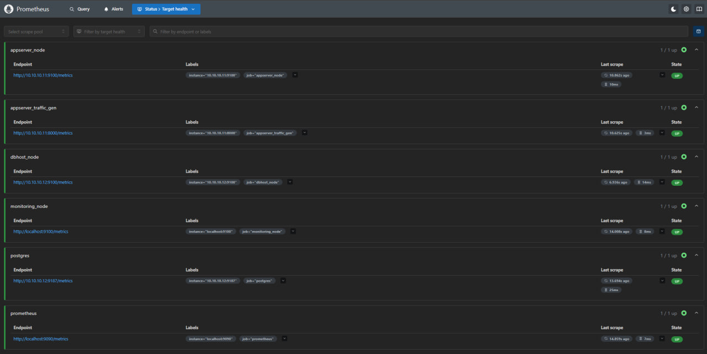
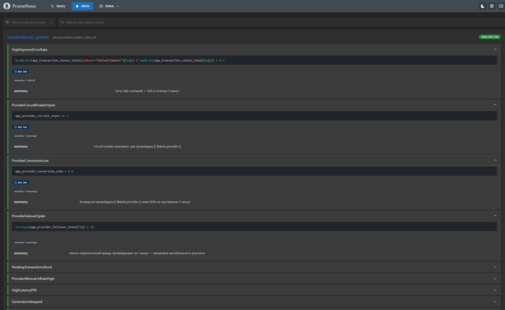
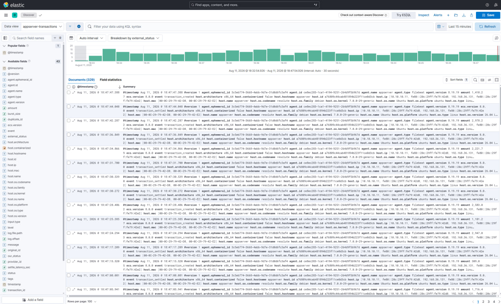
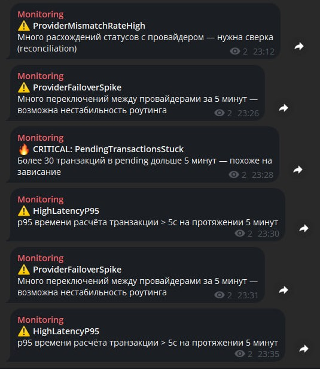

# Payment Gateway Monitoring Lab

Учебная лаборатория мониторинга транзакционной системы (платёжный шлюз) —
полный стек SRE-инструментов на 3 виртуальных машинах: сбор метрик, логов,
алертинг с доставкой в Telegram/почту, circuit breaker и управляемые
сценарии деградации для отработки инцидентов.

> Собрано с нуля: от разворачивания ВМ и сети до дашбордов и ранбуков.
> Ниже — что именно тут есть и зачем.

## Зачем этот проект

Классические туториалы по Prometheus/Grafana дают поставить и посмотреть
демо-дашборд. Здесь система сама генерирует правдоподобный
транзакционный трафик (депозиты/выводы, несколько платёжных провайдеров,
AML-паттерны, зависшие транзакции, расхождения статусов с провайдером) —
и позволяет **включать конкретные аварии по требованию**, наблюдать, как
их видно на дашбордах, и тренировать разбор инцидента по ранбуку.

## Архитектура

## Стек

| Слой                   | Инструмент                                                                 |
|------------------------|----------------------------------------------------------------------------|
| Метрики (инфра)        | Zabbix                                                                     |
| Метрики (приложение)   | Prometheus + custom exporter (`prometheus_client`)                         |
| Визуализация           | Grafana                                                                    |
| Логи                   | ELK (Elasticsearch, Logstash, Kibana) + Filebeat                           |
| Алертинг               | Alertmanager → Telegram + Email                                            |
| Chaos engineering      | Toxiproxy (латентность/таймауты/обрывы на сеть и провайдеров)              |
| Отказоустойчивость     | Circuit breaker (closed/open/half-open) с авто-failover между провайдерами |
| БД                     | PostgreSQL 18                                                              |

## Что тут можно посмотреть

- **[docs/course.md](docs/course.md)** — полный курс по модулям: от архитектуры ВМ до SQL-запросов на поиск аномалий
- **[docs/runbooks/](docs/runbooks/)** — ранбуки по конкретным типам инцидентов
- **[appserver/traffic_gen/](appserver/traffic_gen/)** — сам генератор трафика с circuit breaker

## Сценарии аварий, которые можно воспроизвести одной командой

Через интерактивное меню `traffic_gen.py run`:
- Деградация конкретного провайдера (латентность / таймауты / полный отказ) — и наблюдение, как circuit breaker переключает трафик на других
- Зависшие pending-транзакции
- Расхождение статусов между нашей системой и провайдером (reconciliation)
- Недоступность БД
- Долгая блокировка в БД
- Всплеск нагрузки

## Скриншоты

### Grafana — business & infra metrics

### Prometheus — all targets UP

### Alert rules

### Kibana — transaction logs

### Telegram notifications

Собрано в рамках самостоятельного изучения SRE / мониторинга высоконагруженных
транзакционных систем.

## Документация по стеку

### ОС и виртуализация
- [Ubuntu Server documentation](https://ubuntu.com/server/docs)
- [netplan reference](https://netplan.readthedocs.io/en/stable/netplan-yaml/)
- [systemd.unit / systemd.service man pages](https://www.freedesktop.org/software/systemd/man/latest/systemd.service.html)

### База данных
- [PostgreSQL 18 — официальная документация](https://www.postgresql.org/docs/18/index.html)
- [pg_hba.conf — client authentication](https://www.postgresql.org/docs/current/auth-pg-hba-conf.html)

### Метрики и визуализация
- [Prometheus documentation](https://prometheus.io/docs/introduction/overview/)
- [PromQL — querying basics](https://prometheus.io/docs/prometheus/latest/querying/basics/)
- [Alertmanager documentation](https://prometheus.io/docs/alerting/latest/alertmanager/)
- [Alertmanager configuration reference](https://prometheus.io/docs/alerting/latest/configuration/)
- [node_exporter](https://github.com/prometheus/node_exporter)
- [postgres_exporter](https://github.com/prometheus-community/postgres_exporter)
- [prometheus_client (Python)](https://github.com/prometheus/client_python)
- [Grafana documentation](https://grafana.com/docs/grafana/latest/)
- [Grafana — Prometheus data source](https://grafana.com/docs/grafana/latest/datasources/prometheus/)
- [Grafana — Alertmanager data source](https://grafana.com/docs/grafana/latest/datasources/alertmanager/)

### Логи (ELK)
- [Elasticsearch Guide (8.x)](https://www.elastic.co/guide/en/elasticsearch/reference/8.19/index.html)
- [Logstash Reference](https://www.elastic.co/guide/en/logstash/8.19/index.html)
- [Kibana Guide](https://www.elastic.co/guide/en/kibana/8.19/index.html)
- [Filebeat Reference](https://www.elastic.co/guide/en/beats/filebeat/8.19/index.html)
- [Elasticsearch — Disk-based shard allocation (watermarks)](https://www.elastic.co/guide/en/elasticsearch/reference/8.19/modules-cluster.html#disk-based-shard-allocation)

### Инфраструктурный мониторинг
- [Zabbix 7.0 Manual](https://www.zabbix.com/documentation/7.0/en/manual)
- [Zabbix — актуальная версия документации (auto-redirect)](https://www.zabbix.com/documentation/current/en/manual)
- [Zabbix — triggers and expressions](https://www.zabbix.com/documentation/7.0/en/manual/config/triggers)

### Полезно, но не обязательно
- [tmux cheat sheet](https://tmuxcheatsheet.com/)
- [Awesome Prometheus alerting rules (примеры на будущее)](https://awesome-prometheus-alerts.grep.to/rules)
